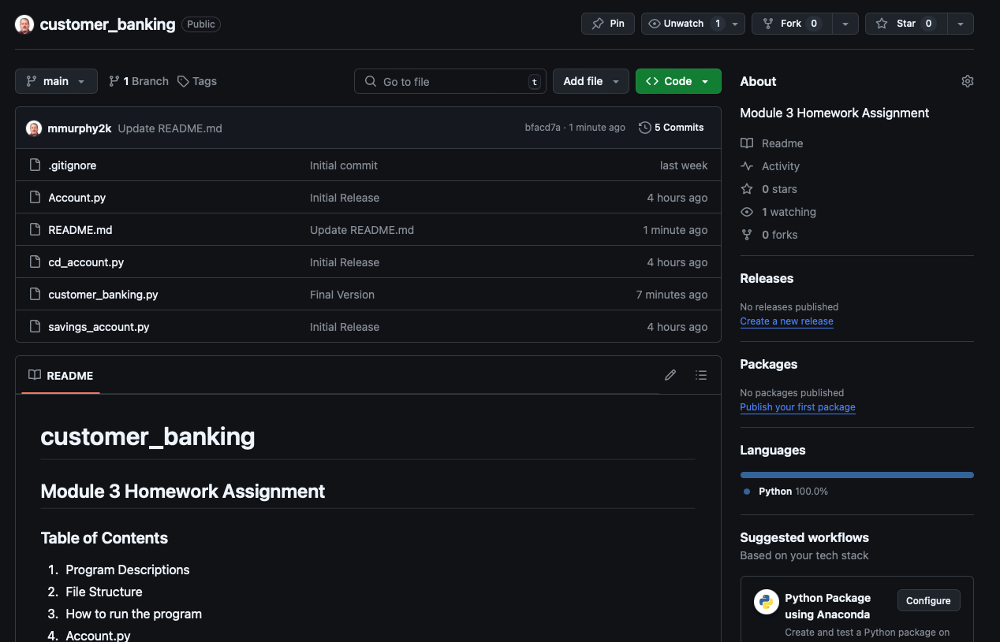

# customer_banking
## Module 3 Homework Assignment
### Table of Contents
1. **Program Descriptions**
2. **File Structure**
3. **How to run the program**
4. **Account.py**
5. **cd_account.py**
6. **customer_banking.py**
7. **README.md**
8. **savings_account.py**

## 1. **Program Descriptions**

This program is a customer banking system that allows users to calculate and track interest earned on savings and CD accounts. By running this application, users will be able to enter their savings and CD account information, see the interest earned, and view the updated balances after a specified number of months.

## 2. **File Structure**

## 3. **How to run the program**

## 4. **Account.py**

## 5. **cd_account.py**

## 6. **customer_banking.py**

## 7. **README.md**

## 8. **savings_account.py**

Mark Murphy mmurphy2k@gmail.com
